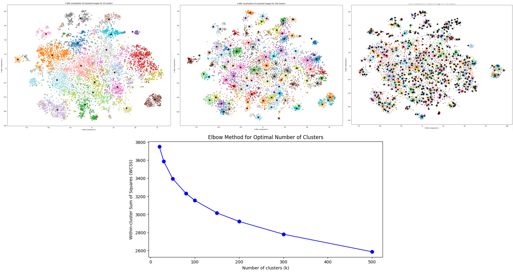
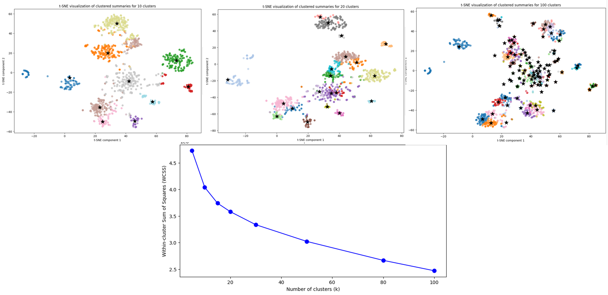
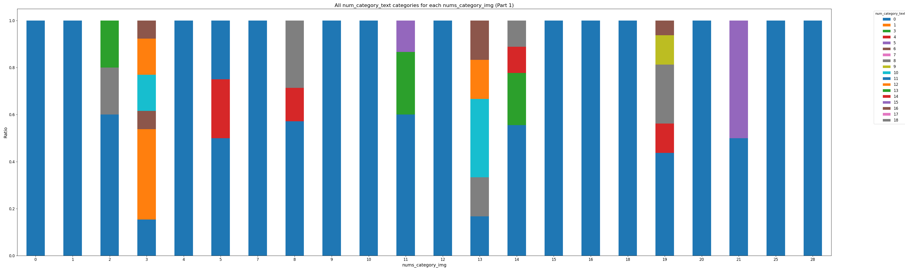
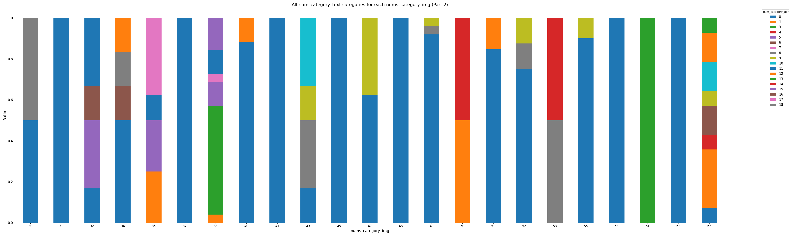
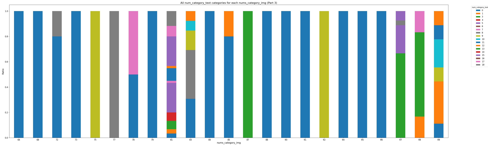

# 聚类获得标签


## image聚类

过程：
1. 图片预处理清洗：首先使用[`segment`](https://github.com/dengxw66/Multimodal_MKT/segment/SemanticGuidedHumanMatting)分割的效果好于直接分类。
2. 经过实验，使用[`imagebind`](https://arxiv.org/abs/2305.05665)做encoder好于使用[`resnet`](https://github.com/KaimingHe/deep-residual-networks)。因此使用imagebind做embedding。
3. 使用Kmeans聚类，使用肘部法(Elbow Method)得到合适的聚类数量，大致100个类别为最佳（拐点处）。见文件：[`output_img`](https://github.com/dengxw66/Multimodal_MKT/label/output_img),聚类结果举例见下图。[`clustered_labels100.csv`](https://github.com/dengxw66/Multimodal_MKT/label/output_img/clustered_labels100.csv)是具体全部类别结果。

<p align="center">
    
    <br>
    <strong>图片聚类，肘部法(Elbow Method)，自适应得到最佳聚类数量</strong>
</p>

<p align="center">
    
    <br>
    <strong>图片聚类结果举例</strong>
</p>

## text聚类

过程：
1. 文本预处理清洗：使用使用stopwords_en.txt过滤语气词，然后转化emoji为文本格式。并合并post的所有主要文本：['post_content', 'post_tag', 'post_title']为['summary']
2. 使用[`imagebind`](https://arxiv.org/abs/2305.05665)做encoder得到['summary']的embedding。保持和图片encoder一致。
3. 使用Kmeans对['summary']聚类，使用肘部法(Elbow Method)得到合适的聚类数量，大致20个类别为最佳（拐点处）。结果见[`clustered_summaries20.json`](https://github.com/dengxw66/Multimodal_MKT/label/output_text/clustered_summaries20.json)。

<p align="center">
    
    <br>
    <strong>文本聚类，肘部法(Elbow Method)，自适应得到最佳聚类数量</strong>
</p>

- 文本聚类结果举例:
```
- poster_id: 5a92b3dae8ac2b226e3a7cd5
  post_id: 66680b7a000000001d014d49
  summary: 怕太显眼又怕你看不见 小红书 #Ootd #微胖女孩 #穿搭 #高跟鞋 #鞋控の日常 #OOTD穿搭 #日常 #不被定义 Ootd, 微胖女孩, 穿搭, 高跟鞋, 鞋控の日常, OOTD穿搭, 日常, 不被定义
  cluster: 0

- poster_id: 5a92b3dae8ac2b226e3a7cd5
  post_id: 66612598000000000f00d8e5
  summary: 阳光明媚 我也是 小红书 #甜妹 #穿搭 #oodt日常穿搭 #迈入人间六月天 #微胖女孩 #鞋控の日常 #高跟鞋 #大长腿 #丝袜 甜妹, 穿搭, oodt日常穿搭, 迈入人间六月天, 微胖女孩, 鞋控の日常, 高跟鞋, 大长腿, 丝袜
  cluster: 0

- poster_id: 5a92b3dae8ac2b226e3a7cd5
  post_id: 665d7f4b000000000f00c2c6
  summary: 不说永远 在每个瞬间 小红书 #ootd每日穿搭 #穿搭 #微胖女孩 #平底鞋 #温柔穿搭 ootd每日穿搭, 穿搭, 微胖女孩, 平底鞋, 温柔穿搭
  cluster: 0

- poster_id: 5b287ba611be102bd290b2ff
  post_id: 655855150000000032003e99
  summary: 毛茸茸真的好有冬天氛围感！！:snowflake::cheese_wedge: 小红书 nan nan
  cluster: 18

- poster_id: 5b287ba611be102bd290b2ff
  post_id: 65574dcf000000001b03484f
  summary: 毛绒绒的羊羔毛太有冬天的感觉啦！！:snowflake: 小红书 nan nan
  cluster: 18

- poster_id: 5b287ba611be102bd290b2ff
  post_id: 6556c6050000000032008f45
  summary: 入冬第一件绿色羽绒服！！好好看～:snowflake: 小红书 nan nan
  cluster: 18
```


## 最终结果

1. 首先使用image聚类，得到每个帖子的图片对应类别，见文件：[`clustered_labels100.csv`](https://github.com/dengxw66/Multimodal_MKT/label/output_img/labels.json)
2. 再使用text聚类，得到每个帖子的文本对应类别，见文件：[`clustered_summaries20.json`](https://github.com/dengxw66/Multimodal_MKT/label/output_text/clustered_summaries20.json)
3. 图片和文本交叉索引序号。图片为一级标签，文本为二级标签。找到每个图片聚类中，占比最高的文本。见文件：[`combined_clustered_matched_image_text.csv`](https://github.com/dengxw66/Multimodal_MKT/label/output_all/combined_clustered_matched_image_text.csv)
4. 统计指标见[`category_ratios.csv`](https://github.com/dengxw66/Multimodal_MKT/label/output_all/category_ratios.csv)，其中的ratio为比例/百分比。见下图举例


| nums_category_img | num_category_text | ratio                    |
|-------------------|-------------------|--------------------------|
| 30                | 0                 | 0.5                      |
| 30                | 8                 | 0.5                      |
| 64                | 0                 | 1.0                      |
| 0                 | 0                 | 1.0                      |
| 84                | 0                 | 1.0                      |
| 16                | 0                 | 1.0                      |
| 10                | 0                 | 1.0                      |
| 90                | 0                 | 1.0                      |
| 34                | 0                 | 0.5                      |
| 34                | 8                 | 0.16666666666666666      |
| 34                | 6                 | 0.16666666666666666      |
| 34                | 12                | 0.16666666666666666      |
| 47                | 0                 | 0.625                    |
| 47                | 9                 | 0.375                    |
| 15                | 0                 | 1.0                      |
| 49                | 0                 | 0.92                     |
| 49                | 8                 | 0.04                     |
| 49                | 9                 | 0.04                     |
| 18                | 0                 | 1.0                      |
| 20                | 0                 | 1.0                      |
| 40                | 0                 | 0.8823529411764706       |
| 40                | 1                 | 0.11764705882352941      |
| 88                | 0                 | 1.0                      |
| 81                | 0                 | 0.03333333333333333      |
| 81                | 5                 | 0.23333333333333334      |
| 81                | 15                | 0.23333333333333334      |
| 81                | 3                 | 0.06666666666666667      |
| 81                | 7                 | 0.016666666666666666     |
| 81                | 4                 | 0.06666666666666667      |
| 81                | 18                | 0.11666666666666667      |
| 81                | 17                | 0.08333333333333333      |
| 81                | 1                 | 0.03333333333333333      |
| 81                | 11                | 0.1                      |
| 81                | 12                | 0.016666666666666666     |

- 可视化结果，横坐标是图片类别一共100类。纵坐标(颜色方块)是文本类别一共20类。我们选取每个图片类别中的top3文本类别展示。详细结果见[`all_categories_table_final.csv`](https://github.com/dengxw66/Multimodal_MKT/label/output_all/all_categories_table_final.csv)
<p align="center">
    
    <br>
    <strong>最终image-text聚类比例：0-33图片类</strong>
</p>

<p align="center">
    
    <br>
    <strong>最终image-text聚类比例：34-67图片类</strong>
</p>

<p align="center">
    
    <br>
    <strong>最终image-text聚类比例：67-99图片类</strong>
</p>


## 聚类方法分析
- 其他方案为使用DBSCAN或OPTICS聚类，不指定具体聚类数量，指定类间距离阈值后，自适应分类出合理的数量。但是OPTICS方法经过实验聚类结果不大稳定，不如kmeans好。DBSCAN方法会有大量的噪声点直接舍弃，如果减少舍弃的点，整体的聚类效果会变差。因此选择Kmeans+肘部法。


