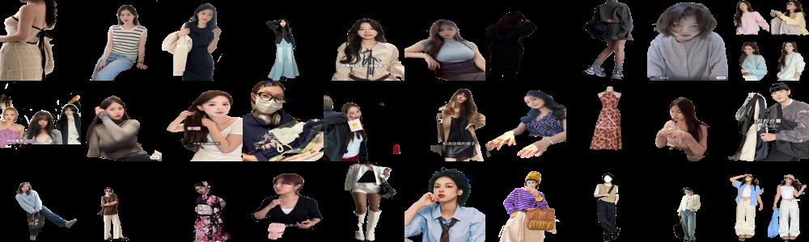

# multimodal cluster

## 结论：

1. image分类：各类的数目分布基本均匀，但是sihoulette数目不正常。
2. text分类：sihoulette数目正常，但是出现极端分布。
3. 多模态分类：sihoulette数目正常，但是出现极端分布。

- 全部失败。核心原因可能是text不可靠（text越长，聚类效果越差，因此纯text或多模态均失败了）

## 新发现：

- 怀疑image的embedding维度过高，导致sihoulette失败。
- 使用umap方法对于image的embedding进行降维后，发现效果显著，如下：
1. 聚类数目sihoulette曲线，合理
2. 分布均匀程度/各个月占比，合理
3. 每个月具体的风格合理性，合理

- 也许umap降维，可以作为一个有潜力的方向继续探索?


# 1. 整体步骤


1. 对于图片：
    - 去掉其中black area 大于95%的bad case.使用body segment
    - 和上次图片处理方法一致。
2. 对于文本：
    - 对于post的'post_content'和'post_tag'拼接在一起
    - 具体来说：进行使用[`jieba`]分词，使得句子变为一些key words。使用关键词提取技术[`RAKE`],得到这个句子中最重要的关键词。
3. 对于多模态：
    - 使用imagebind得到image和text的embedding向量，然后concatenate拼成一个向量。
    - 并行拼接：[text embedding, image embedding]，将1 * 10 和 1 * 10 拼成 1 *20
4. 进行cluster聚类。
    - 使用sihouette计算最佳聚类数目。可视化每个类型的结果，看看每个类中的效果是否make sense


# 2. 具体处理


## 2.1 image处理

1. 首先segment衣服，并计算出每个衣服的占比全图的面积。根据面积的分布情况，和segment后的识别能力，得到threshold为5%。因此去掉其中black area占比超过95%的图片（即衣服占比太少＜5%的图片都去掉）。

2. 然后对于剩下的图片进行人体segment


<p align="center">
    
    <br>
    <strong>Fig.1, image的sihoulette曲线</strong>
</p>

<p align="center">
    
    <br>
    <strong>Fig.2, image的散点图分布，聚类数目取200</strong>
</p>

<p align="center">
    
    <br>
    <strong>Fig.3, image的每个月的分布，聚类数目取200 </strong>
</p>

- 结论：失败。sihoulette曲线不正常，没有出现合适的聚类数量.（和上次组会汇报一致）

<p align="center">
    
    <br>
    <strong>Fig.3, image（raw data，不使用任何segment）的sihoulette曲线，仍然是下降的 </strong>
</p>


## 2.2 text处理


句子：'花卉连衣裙这样搭配真的好好看❤️ - 小红书,,05-17,,#白茶姐弟 #每日穿搭 #气质连衣裙 #连衣裙 #显瘦连衣裙'

0. 数据清洗：去掉语气词和无关词汇[`stopwords_cn.txt`]，去掉nan异常词汇，表情包转化[`emoji`]
    - 得到：'花卉连衣裙 搭配真的好好看(爱心)   白茶姐弟  每日穿搭  气质连衣裙  连衣裙  显瘦连衣裙 '
1. 首先使用[`jieba`]分词，使得句子变为一些key words。
    - 得到：'花卉 连衣裙   搭配 真的 好好看 ( 爱心 )  白茶 姐弟  每日 穿 搭  气质 连衣裙  连衣裙   显瘦 连衣裙'
2. 然后使用关键词提取技术[`RAKE`],得到这个句子中最重要的关键词。
    - 得到：'白茶 姐弟 每日 穿 搭 气质 连衣裙 连衣裙 显瘦 连衣裙'
3. 对这些关键词当作一个句子，直接进行embedding和cluster
    - 使用text2vec-large-chinese，进行embedding

上述细节见代码：[`data.ipynb`](https://github.com/dengxw66/Multimodal_MKT/blob/dxw_devlop/label/text-cluster/data.ipynb)

text选取完整content和纯tag，两种情况进行测试


### 2.2.1 text (content)

- 使用content部分，即完整的：'花卉连衣裙这样搭配真的好好看❤️ - 小红书,,05-17,,#白茶姐弟 #每日穿搭 #气质连衣裙 #连衣裙 #显瘦连衣裙'

<p align="center">
    
    <br>
    <strong>Fig.4, 使用text(content)的sihoulette曲线</strong>
</p>


<p align="center">
    
    <br>
    <strong>Fig.5, 使用text(content)的散点图分布，聚类数目取200</strong>
</p>

<p align="center">
    
    <br>
    <strong>Fig.6, 使用text(content)的每个月的分布，聚类数目取200。出现极端分布，占比高的为长文本</strong>
</p>


- 结论：失败。散点图分布不合理，每个月占比太过于极端。


### 2.2.2 text (Tag)

- 使用Tag部分，即仅使用：'#白茶姐弟 #每日穿搭 #气质连衣裙 #连衣裙 #显瘦连衣裙'

<p align="center">
    
    <br>
    <strong>Fig.7, 使用text(tag)的sihoulette曲线</strong>
</p>


<p align="center">
    
    <br>
    <strong>Fig.8, 使用text(tag)的散点图分布，聚类数目取200</strong>
</p>


<p align="center">
    
    <br>
    <strong>Fig.9, 使用text(tag)的每个月的分布，聚类数目取200。出现极端分布，占比高的为长文本</strong>
</p>

- 结论：失败。每个月占比太过于极端。

### 2.2.3 text 代表性output可视化

```
{
    "0": [
        "养发护发, 穿搭, 自信, 变美, 发型, 女生必看, 变瘦变美变好看, 变美逆袭, 成长, 变美思路, 反差感, 变美小技巧, 氛围感美女, 逆袭, 变美我熟, 笔记灵感, 奥妙内衣洗衣液, 内衣洗衣液, 奥妙除真菌",
        "异地恋见面, 异地恋日常, 恋爱日常, 情侣日常, 情侣约会, vlog, vlog日常, vlog我的一天, 记录我的生活, 生活碎片, 恋爱日记, 甜甜的恋爱, 生活vlog",
        "当氛围感穿搭走进现实生活, 慵懒感穿搭, 牛角扣大衣, 实用穿搭, 穿搭合集, 秋冬叠穿, 羊毛大衣, 大衣穿搭, 大衣搭配, 好看的大衣",
        "旗袍, 日常旗袍, 国风旗袍, 民国风, 旗袍穿搭, 紫色系, 浪漫生话的记录者, 尝试一个新look, 今天穿什么香, 时尚",
        "今天穿这样, 氛围感穿搭夏天, 夏季穿搭, 套装, 日常穿搭, 高个子穿搭, 不费力气的穿搭, ootd每日穿搭, 运动穿搭, 明天想看啥",
        "旗袍, 民国风, 日常旗袍, 氛围感, 光是一切氛围感的来源, 会发光的裙子, 日常碎片PLOG, 拍出氛围感, 民国旗袍",
        "穿漂亮衣服过春天, 笔记灵感, 高个子女生穿搭, 高个子穿搭, 裙子分享, 春天穿什么, 超会穿企划, 我的ootd, 挑战一周穿搭不重样",
        "ootd每日穿搭, 日常穿搭, 穿搭, 气质穿搭, 秋冬穿搭, 极简穿搭, 简约穿搭, 大衣穿搭, 休闲穿搭, 高级感穿搭, 黑白灰简约搭配",
        "日系, 日系穿搭, 亲子穿搭, 同色系穿搭, 松弛感穿搭, 不费力气的穿搭, 日系叠穿",
        "汉洋折衷, 这也太可爱了吧, 汉洋折衷搭配, 马面裙, 马面裙日常, 中华风, 中华风穿搭, 国风, 甜妹"
    ],
    "1": [
        "复古旗袍, 棋盘格, 定制旗袍, 港风旗袍",
        "浪漫生活的记录者, 日常生活里的快乐瞬间, 度假穿什么, 海边拍照",
        "氛围感, 调色, 小小氛围感拿捏, 火车拍照, 拯救废片, 我超会p图der",
        "新年, 在迎接2024, 来拍照了, 2024, 跨年, 元旦, 我的日常",
        "短发, 日系短发, 我的日常",
        "贵气感, 珍珠项链, GiO珠宝, 一眼心动, 财阀千金穿搭",
        "年度总结, 我的日常, 我的年度9图",
        "拍照姿势, ins, 度假穿什么, TF口红, TF金箔唇油, TF夏日限定",
        "随便发发, 今日妆容, 日常妆容打卡, 帽子, 帽子分享, 今日快乐今日发",
        "香港, 富士, 富士NC滤镜, 潮流街區"
    ],
   "2": [
        "MioHarutaka, 饰品搭配, 珠宝设计, hermes, birkin, 爱马仕铂金包, 爱马仕birkin, 翻包记",
        "MioHarutaka, 珠宝设计, 饰品搭配, 翻包记, hermes, 爱马仕birkin",
        "lv, 路易威登louisvuitton, LouisVuitton, LV, Trainer, keepall, 晒新包包, 鞋控の日常",
        "爱马仕, hermes爱马仕, hermes",
        "Chaumet冠冕大展, 冠冕大师CHAUMET, Chaumet尚美巴黎, 上海看展",
        "loewe, loewecubi, 跟着买就对了, 包包分享, 最爱的包包, 晒新包包",
        "goyard, 包治百病",
        "购物分享, i人是如何购物的, 识季, 识季app, Celine, CHENAL, Ysl, lv, maxmara, 大衣分享",
        "爱马仕Birkin25, hermes, jilsander",
        "MK翠贝卡手袋, MichaelKors, MK真香, MK, 晒新包包, ootd每日穿搭"
    ],
    "3": [
        "毛衣, 秋冬毛衣, 毛衣搭配, 购物分享",
        "服装定制, 真丝丝绒, 看到最后",
        "服装定制, 香云纱, 新中式, 上衣, 看到最后",
        "服装定制, 新中式, 国风, 上衣, 外套, 看到最后",
        "服装定制, 新中式, 手工, 双面羊绒大衣, 看到最后",
        "服装定制, 新中式, 外套, 真丝, 看到最后",
        "服装定制, 新中式, 香云纱, 上衣, 看到最后",
        "国风, 新中式, 香云纱, 西服, 看到最后",
        "服装定制, 宋锦, 新中式, 马甲, 看到最后",
        "服装定制, 新中式, 马甲, 看到最后"
    ],
    "4": [
        "日常碎片PLOG, 女生短发发型, 来拍照了, 这就是过年的意义吧",
        "日常碎片PLOG, 女生短发发型, 笔记灵感, 我的漂亮只献给自己",
        "女生短发发型, 日常碎片PLOG, 老公, 来拍照了, 是live也是life",
        "日常碎片PLOG, 女生短发发型, 笔记灵感, 宝宝辅食, 去春天里遛遛自己",
        "记录我的生活, 我的日常, plog",
        "女生短发发型, 日常碎片PLOG, 氛围感, 卷毛, 只是为了几个瞬间, 笔记灵感",
        "笔记灵感, 女生短发发型, 当然要记录啊, 日常碎片PLOG",
        "女生短发发型, 来拍照了, 日常碎片PLOG, 笔记灵感",
        "女生短发发型, 日常碎片PLOG, 用一张照片开启冬天的故事, 笔记灵感",
        "女生短发发型, 旅游, 短发女生, 日常碎片PLOG"
    ],
    "5": [
        "随手拍的好风景",
        "购物分享",
        "小香外套, 新中式",
        "公主切发型",
        "记一个晴朗有风的下午",
        "春天是个盛大的形容词",
        "接下来期待的是春天",
        "浅浅的期待一下秋冬",
        "一周穿搭不重样",
        "来做一场红楼梦"
    ],
    "6": [
        "MioHarutaka, 饰品搭配, 珠宝设计, 婚礼晚宴, 晚宴穿搭, Ootd, ootd每日穿搭",
        "MioHarutaka, 饰品搭配, 珠宝设计, 珠宝, Ootd, ootd每日穿搭",
        "MioHarutaka, 饰品搭配, 珠宝设计, OOTW, Ootd, 初秋穿搭, 初秋搭配, 独立设计师",
        "MioHarutaka, 珠宝设计, 饰品搭配, OotD, 采访, 巴黎",
        "MioHarutaka, 珠宝设计, 饰品搭配, Ootd, 日常穿搭, 巴黎, Akari, 黑白穿搭",
        "MioHarutaka, 珠宝设计, 饰品搭配, OotD",
        "MioHarutaka, 和女儿的日常, vintage, 牛仔裤, OotD",
        "MioHarutaka, 饰品搭配, 珠宝设计, 纽约, 纽约生活, Ootd, OOTW, 骗你生女儿",
        "下班, MioHarutaka, 饰品搭配, 珠宝设计, Ootd",
        "MioHarutaka, 饰品搭配, 珠宝设计, 配饰分享, Ootd, ootd每日穿搭"
    ],
    "7": [
        "150cm女生穿搭, 小个子穿搭, 小个子长靴, OotD, 秋天穿什么",
        "150cm女生穿搭, 小个子穿搭, 未婚, 女性成长",
        "150cm女生穿搭, 小个子穿搭, OotD, 小个子女生的穿搭法则, 每日穿搭",
        "150cm女生穿搭, 小个子穿搭, OotD, 南京旅游, 南京音乐台",
        "元气少女, 少女感穿搭, 少女穿搭, 街拍, Ootd",
        "150cm女生穿搭, OotD, 小个子穿搭, 泉州, 150小个子穿搭",
        "我的上班通勤穿搭, 小个子穿搭, 150cm女生穿搭, OotD, 今日穿搭, 灵感笔记",
        "我的上班通勤穿搭, 裤子分享, OotD, 150cm女生穿搭, 小个子穿搭, 今天穿什么",
        "小个子穿搭, 小个子女生穿搭, 150cm女生穿搭, 小个子初冬, OotD",
        "小个子穿搭, OotD, 小个子女生穿搭, 150cm女生穿搭, 今天穿搭"
    ],
    "8": [
        "我的日常",
        "我的日常",
        "天使",
        "我的日常",
        "我的日常",
        "日常",
        "日常",
        "美式复古",
        "我的日常",
        "我的日常"
    ],
    "9": [
        "每日穿搭, 日常穿搭, acne",
        "穿搭, 日常穿搭",
        "穿搭, 日常穿搭",
        "每日穿搭, 日常穿搭",
        "每日穿搭, 度假穿搭",
        "GR相机, 穿搭",
        "日常穿搭, 每日穿搭, 穿搭灵感, 极简穿搭",
        "穿搭, 日常穿搭",
        "穿搭, 日常穿搭",
        "出遊穿搭, 穿搭, 夏季穿搭"
    ],
    "10": [
        "拍照, 度假, 海边穿搭, 沙滩, 朋友圈",
        "拍照, 显高显瘦显腿长, 日常穿搭",
        "极简穿搭, 穿搭灵感, 晒什么都不如晒太阳, 我的日常",
        "时尚摄影, 高级感, 每日穿搭, 节假日去哪儿",
        "新中式, 新中式穿搭, 极简风, 宋代美学, 品牌安利",
        "梨形身材, 格子控, 日系, 日系穿搭",
        "黑丝, 高级感穿搭, ins风, 时尚春上新, 2024时尚趋势, 黄小姐0d黑丝",
        "每天一个穿搭灵感, 我的日常, 每日穿搭",
        "记录生活, 复古风, 复古风穿搭, 浪漫生话的记录者",
        "我的日常, 日常穿搭, 在平凡日子里热爱生活"
    ],
    ...
}

```
- 结论：依靠text分类靠不住，每一类没有明显规律。
- 特点：
    1. 文本越长，分类越差
    2. 去掉nan的异常数据
    3. 倾向于将有大量重复文本出现的划分为一类

## 2.3 多模态


使用text(content)和image(body segment)拼接进行多模态

<p align="center">
    
    <br>
    <strong>Fig.10, 多模态 sihoulette曲线</strong>
</p>

<p align="center">
    
    <br>
    <strong>Fig.11, 多模态 聚类数目取190，散点图分布</strong>
</p>

<p align="center">
    
    <br>
    <strong>Fig.12, 多模态，每个月的分布，聚类数目取190，仍然出现极端分布</strong>
</p>

- 结论： 失败。多模态仍然出现极端分布。考虑到前面text分类效果，text的引入可能是干扰


# 5 其他发现


- 使用降维算法：怀疑是embedding维度太高了

## 5.1 多模态降维

<p align="center">
    
    <br>
    <strong>Fig.13, 多模态 使用umap降维算法，分布情况 </strong>
</p>
 
<p align="center">
    
    <br>
    <strong>Fig.14, 多模态 使用umap降维算法，sihoulette曲线，是下降的 </strong>
</p>


- 结论，失败，不符合要求

## 5.2 image降维

- 结论，成功。
    1. 聚类数目sihoulette曲线，ok
    2. 分布均匀程度/各个月占比，ok
    3. 每个月具体的风格合理性，ok

<p align="center">
    
    <br>
    <strong>Fig.15, image 进行umap降维后 分布 </strong>
</p>


<p align="center">
    
    <br>
    <strong>Fig.16, image 进行umap降维后 的sihoulette曲线，符合要求 </strong>
</p>


<p align="center">
    
    <br>
    <strong>Fig.17, image 进行umap降维后 散点图，分布均匀，符合要求 </strong>
</p>


<p align="center">
    
    <br>
    <strong>Fig.18, image 进行umap降维后 每个月持续时间图 </strong>
</p>


<p align="center">
    
    <br>
    <strong>Fig.19, month_1_top5 可视化 </strong>
</p>

<p align="center">
    
    <br>
    <strong>Fig.20, month_2_top5 可视化 </strong>
</p>

<p align="center">
    
    <br>
    <strong>Fig.21, month_3_top5 可视化 </strong>
</p>

<p align="center">
    
    <br>
    <strong>Fig.22, month_4_top5 可视化 </strong>
</p>

<p align="center">
    
    <br>
    <strong>Fig.23, month_5_top5 可视化 </strong>
</p>

<p align="center">
    
    <br>
    <strong>Fig.24, month_6_top5 可视化 </strong>
</p>

<p align="center">
    
    <br>
    <strong>Fig.25, month_7_top5 可视化 </strong>
</p>

<p align="center">
    
    <br>
    <strong>Fig.26, month_8_top5 可视化 </strong>
</p>

<p align="center">
    
    <br>
    <strong>Fig.27, month_9_top5 可视化 </strong>
</p>

<p align="center">
    
    <br>
    <strong>Fig.28, month_10_top5 可视化 </strong>
</p>

<p align="center">
    
    <br>
    <strong>Fig.29, month_11_top5 可视化 </strong>
</p>

<p align="center">
    
    <br>
    <strong>Fig.30, month_12_top5 可视化 </strong>
</p>


