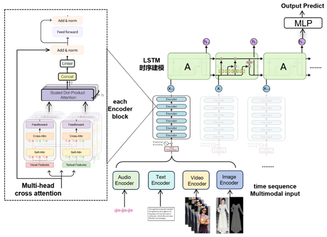

# 多模态识别

# 1. 实验方案：

## 1.1 数据结构

1. 输入：
    1. 图片和文本。(不考虑音频。视频数据也当作图片数据处理)
        - 图片：尽可能只截取衣服。
        - 文本：仅仅为辅助作用。
    2. 其他信息：
        - 考虑热度popularity等信息结合更加重要。​​numerical information: post #like/#collect/#comment; poster 粉丝数/关注数/获赞总量/笔记数量/。
        - Do sentiment analysis on comments
        - 输入2个月的时间窗口（1月1号-2月30号，1月2号到3月1号，1月3号到3月2号）

    - 训练用数据结构
        - 分类数据集结果：[`after2monthdata_20%_with_trend.csv`](https://github.com/dengxw66/Multimodal_MKT/model/after2monthdata_20%_with_trend.csv)，其中的["trend"]为标签。
        - 回归数据集结果：[`after2monthdata_20%.csv`](https://github.com/dengxw66/Multimodal_MKT/model/after2monthdata_20%.csv)，其中的["proportion"]为标签。

2. 输出：
    1. 预测具体数值比例。不是二分类。
        - 考虑到精度，这里也同时采用了拟合和分类两个任务都做了。
    2. 预测时间窗口最后一天在两个月后的占比。（注意是那一整个月的占比）
    3. Label的计算只考虑图片类别，不考虑文本类别。

## 1.2 模型结构

    
     
    <strong>模型结构</strong>

过程：
1. 一次输入60天的数据，每一天的数据都是一批post（含有成对的image和text）
2. 每天的数据都通过transformer的多个encoder模块，并做cross-attention多模态特征融合
3. 然后60天的数据送入一个时序长度为60的LSTM模型做时序融合，输出这60天的最后一天特征。(前59天的时序关系就融合到最后一天里面了)
4. 最后使用mlp对最后一天的特征做预测或分类

# 2. 实验步骤：

## 2.1 复现步骤

1. 数据处理逻辑，一共两步：
- 首先逐步运行：[`data.ipynb`](https://github.com/dengxw66/Multimodal_MKT/model/data.ipynb)。包含了视频切割，图片聚类，文本清洗等步骤。
- 然后逐步运行：[`label.ipynb`](https://github.com/dengxw66/Multimodal_MKT/model/label.ipynb)。负责制作分类数据集[`after2monthdata_20%.csv`](https://github.com/dengxw66/Multimodal_MKT/model/after2monthdata_20%.csv)和回归数据集[`after2monthdata_20%.csv`](https://github.com/dengxw66/Multimodal_MKT/model/after2monthdata_20%.csv)。

2. 训练代码
    -  做分类任务见文件：[`train_classification.ipynb`](https://github.com/dengxw66/Multimodal_MKT/model/train_classification.ipynb)逐次运行文件即可。
    - 做拟合任务见文件：[`train_regression.ipynb`](https://github.com/dengxw66/Multimodal_MKT/model/train_regression.ipynb)逐次运行文件即可。

## 2.2 实验结果

1. 使用总数据的0.2%实验：
    - 做分类任务：见文件：[`train_classification.ipynb`](https://github.com/dengxw66/Multimodal_MKT/model/train_classification.ipynb)，测试集Loss: 0.000458289182157993
    - 做拟合任务：见文件：[`train_regression.ipynb`](https://github.com/dengxw66/Multimodal_MKT/model/train_regression.ipynb)，测试集精度达到100%
2. 更大数据规模(总数据的1%)实验：见文件：[`tran_test.ipynb`](https://github.com/dengxw66/Multimodal_MKT/model/tran_test.ipynb)，测试集精度达到94%

- 结论：在小规模数据集上初步成功。可以尝试更大规模数据集了。

# 3. 后续改进/下周计划

1）使用分割segment衣服的图片，而不是全人体。

2）加入​numerical information: post #like/#collect/#comment; poster 粉丝数/关注数/获赞总量/笔记数量/等信息，目前仅仅使用了文本和图片，暂时没有考虑数量化指标。

3）上述所有方案落实后，开始尝试更大规模数据集训练测试。

