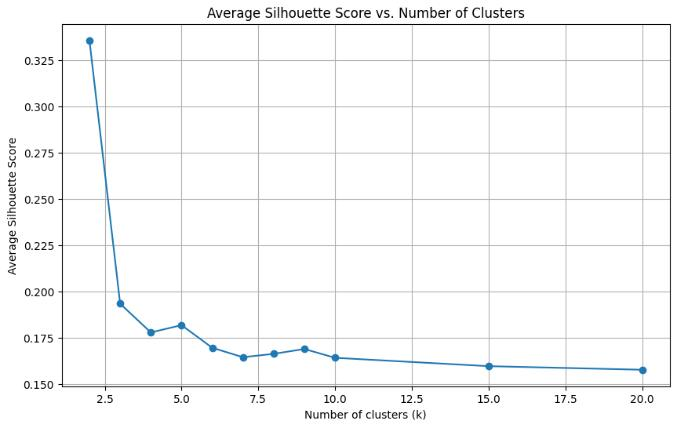
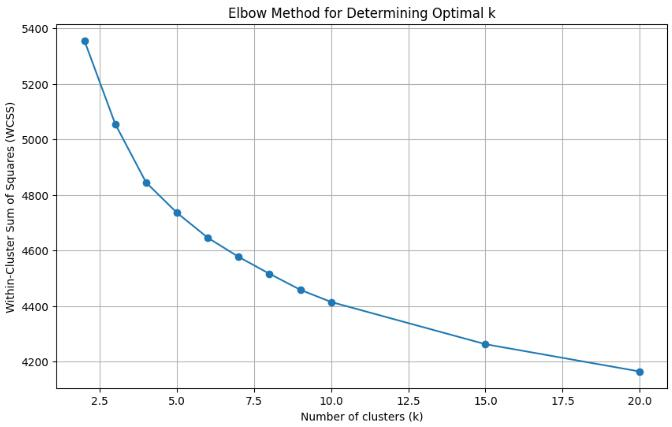
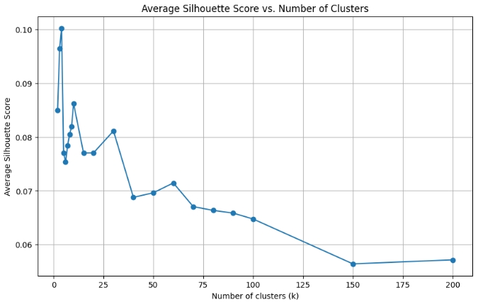
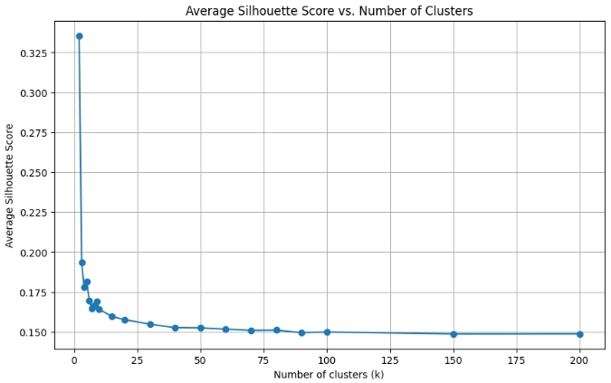
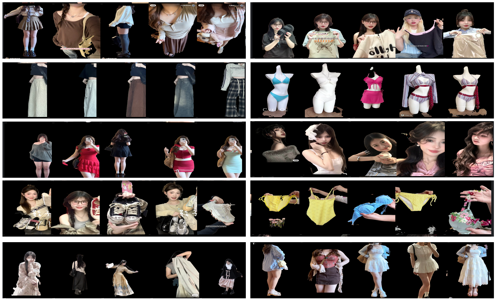
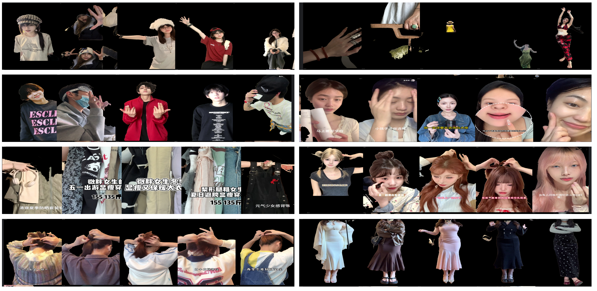

# visualizaiton

## 1. segment 

### 1.1 histogram of black area proportion

    
     
    <strong>Fig.1, segment衣服后 统计图片的black area大小和占比</strong>

### 1.2 visualize black area

    
     
    <strong>Fig.2, segment衣服可视化 black area占比在0-1.0，左边为segment图，右边为原图</strong>

    
     
    <strong>Fig.3, segment衣服可视化 black area占比在0.8-1.0，左边为segment图，右边为原图</strong>

### 1.3 conclusion

- 应该只需要舍弃几乎全黑(黑色占比为1.0,0.98和0.96，在Fig.3,倒数第1/2/3排)的图片。其余图片，即使黑色占比0.94(Fig.3,倒数第四排)仍然可以看出看出衣服轮廓。

## 2. cluster

使用衣服 segment，并舍弃全黑(占比为100%)的图片，保留其余图片做cluster，并使用平均轮廓法silhouette和肘部法elbow两种方法，得到最佳聚类数目，结果如下：

### 2.1 method

    
     
    <strong>Fig.4, 衣服segment聚类，平均轮廓法(Average silhouette)度量最佳聚类数目,最大值在5个cluster左右</strong>

    
     
    <strong>Fig.5, 衣服segment聚类，肘部法(elbow)度量最佳聚类数目，下降趋于平缓的临界点，也在5个cluster左右</strong>

### 2.2 conclusion

- 大致为5个cluster时候，平均轮廓法silhouette和肘部法elbow均显示最优。但是只分为5个类别太少，导致各个类别没有明显风格，分类失败。

## 3. 分析：

### 3.1 为什么上述cluster效果不好，仅聚类为5类？

- 猜想：cluster数目太小的原因 可能是使用衣服segment后，eoncoder无法识别出语义了(一团衣服布 可能无法理解意义，倾向于直接以颜色分类)。而之前的人体的segment 至少能保留人体结构，encoder还能提取出风格信息分类。

- 进行对比实验，验证上述猜想。在仅使用不同的segment方法(衣服/人体)，其余控制一致的情况下，silhouette得到的最佳聚类数目不同。
    - Fig.6, segment人体，可以看到明显的最大值数目，比如10或30左右的时候出现。
    - Fig.7, segment衣服，平缓下降，没有出现明显的最大值聚类数目。仅在开始处，出现了最大值 5左右。

    
     
    <strong>Fig.6, 使用segment人体，平均轮廓法(Average silhouette)度量最佳聚类数目</strong>

    
     
    <strong>Fig.7, 使用segment衣服，平均轮廓法(Average silhouette)度量最佳聚类数目</strong>

### 3.2 为什么之前没有发现'segment衣服聚类数目过少'的问题：
1. 之前的测试是直接从大值(150类下降到20类)开始下降测试，忽略了20类以下的结果
2. 之前聚类的方法有问题，衣服segment后没有重新实验。(现在已经修正)

### 3.3 可能的解决方法：

目标是：
- 得到合适的聚类数量。
- 每个类中的图片看起来确实属于同一类，减少类中误差。

矛盾：
- 引入'身体'是双刃剑：
    - 如果只使用'衣服'聚类，那么模型会当做一块布，无法识别并聚类。
    - 如果使用人体聚类（衣服+身体姿态），模型能通过身体和姿态更好的识别语义，从而得到更合理聚类数量.但是其中也会引入错误聚类（比如明明衣服不同，但是身体姿态一致，也会被当做同一类），类中误差过大。

    
     
    <strong>Fig.8, 人体segment  good case</strong>

    
     
    <strong>Fig.9, 人体segment  bad case</strong>

建议解决方法：
1. 首先使用人体segment聚类，得到几十个类别。
	- 来自同一个poster的几张图片，虽然由于用户的姿态容易一致，更容易被分为同一类。但是这应该是可以接受的，因为本来就是来自同一个poster style tag
2. 然后去掉每个类中，头/身体占比过大的，衣服占比太少的图片。
	- 方法是 使用衣服segment，计算每个图片的black area，去掉black area过大的，比如Fig.9 中的头脸过大的图片）。

