# 可能的数据处理方案

# 1. 概述

## 1.1 基本思路

目标是：
- 得到合适的聚类数量。
- 而且每个类中的图片看起来确实属于同一风格，减少类中误差。

核心矛盾：
- 引入'身体'是双刃剑：
    - 如果只使用'衣服'聚类，那么模型会当做"一块衣服布"，无法理解图片语义，基本只根据颜色分类，无法识别风格。而且得到的聚类数目过少。
    - 如果使用人体聚类（衣服+身体姿态），模型能通过身体和姿态更好的识别语义，从而得到更合理聚类数量，但是其中也会引入错误聚类（比如明明衣服不同，但是身体姿态一致，也会被当做同一类）。

关键发现:
- 只要衣服的面积比例足够大，那么segment人体中，人体姿态等误差的影响就是有限的。
- 因此考虑先去掉衣服面积太少的图片，然后对剩下衣服面积足够大的图片，进行segment人体聚类。

## 1.2 完整方案

1. 去掉衣服占比太少的图：
    - 首先segment衣服，并计算出每个衣服的占比全图的面积。根据面积的分布情况，和segment后的识别能力，得到threshold为6%。因此去掉其中black area占比超过94%的图片（即衣服占比太少＜6%的图片都去掉）。
2. 计算聚类数目：
    - 对于剩下的图片进行人体segment，并使用silhouette计算最佳聚类数目，根据silhouette的极值点，聚类最佳数目大致为58个(暂拟定)。
3. 展示每个类别：
    - 整体分布情况展示。具体每个月的top5结果分布展示。检验是否合理。

# 2. 具体过程

## 2.1 去掉衣服占比太少的图

    
    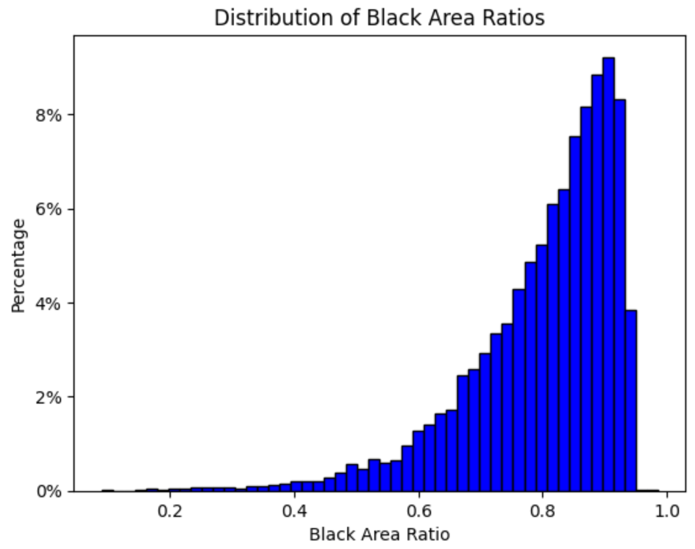
     
    <strong>Fig.1, 去掉衣服占比太少(＜6%)的图片，前后的分布对比。上一张图的最右端(横坐标占比大于0.94)被去除</strong>

    
    
     
    <strong>Fig.2, 可视化剩下图片。左边为segment图，右边为原图。可以看到即使是最下面一行，仍然可以显出足够的衣服形状</strong>

- 结论： 可以通过segment衣服，去掉无法识别cloth的bad case (找到的衣服threshold为小于6%)

## 2.2 计算聚类数目，使用silhouette轮廓法

- 去掉black area(衣服threshold小于6%)的图片后，对于剩下的图片做人体segment，然后聚类。使用silhouette轮廓法找到聚类最佳数目/极大值点

    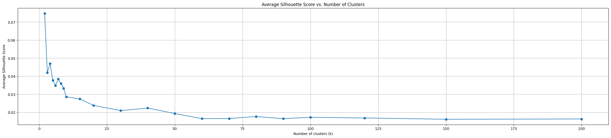
     
    <strong>Fig.3, 0-200的silhouette整体曲线</strong>

    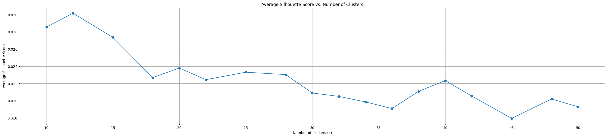
     
    <strong>Fig.4, 0到50的silhouette曲线</strong>

    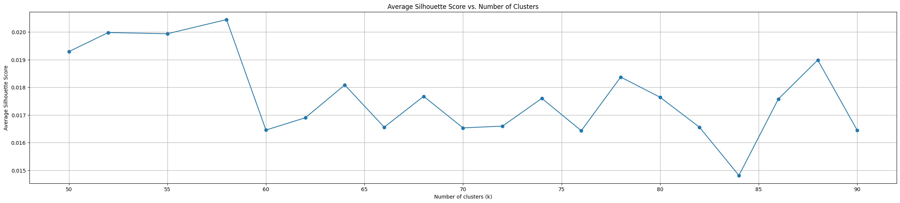
     
    <strong>Fig.5, 50到100的silhouette曲线</strong>

- 结论：具体数目待定...

- silhouette得到的聚类数量，直接做的话(Fig.3)，理论最大值出现在5或12个的时候，但是这样聚类数量太少了。所以我们能不能人为规定一个大概范围(比如50-100)，然后从这个范围(Fig.5)里面再找最佳聚类数量？比如我发现在58和88的时候silhouette值出现了明显的拐点/极大值点(虽然都没有5或12的时候高)

## 2.3 可视化

- 下面的结果是使用silhouette得到的58类(暂拟定)，来做聚类得到的category

### 2.3.1 整体类别分布情况展示

    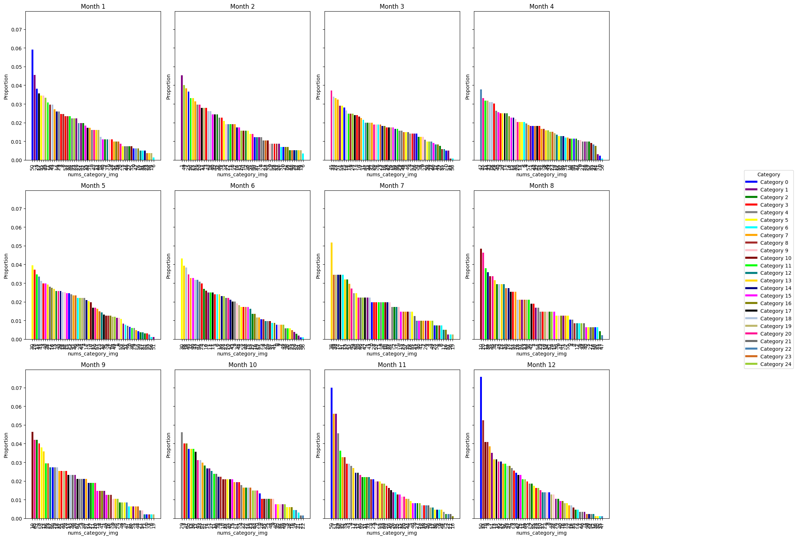
     
    <strong>Fig.6, 每个月的所有category的proportion。没有出现明显过大或过低的异常分布情况。</strong>

    
     
    <strong>Fig.7, 全年各个风格持续时长。不同颜色的高度代表不同category。发现同一个风格最多持续出现3个月(有两处)</strong>

### 2.3.2 具体每个月的top5展示

- 每个图代表一个月，分布是5*10张图片组合。5行代表top5，即每行代表同一个风格。每行10张图，即每个风格采样10张图片。

    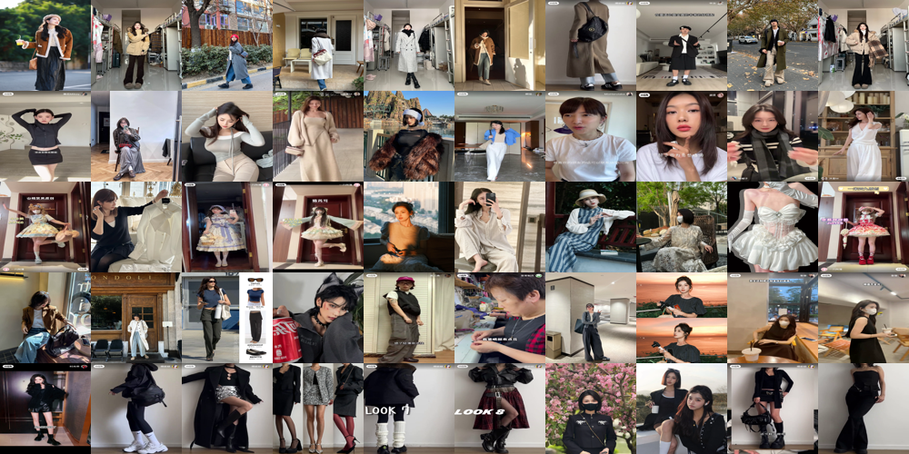
     
    <strong>Fig.7, month_1_top5</strong>

    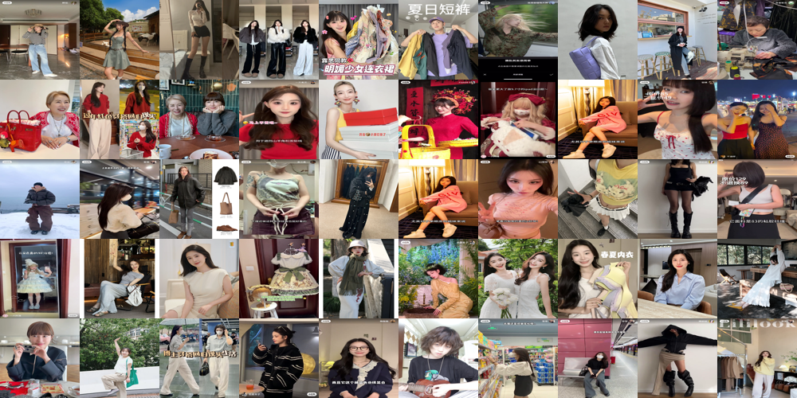
     
    <strong>Fig.8, month_2_top5</strong>

    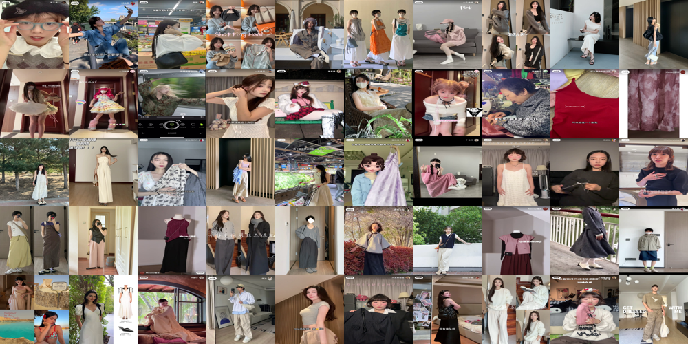
     
    <strong>Fig.9, month_3_top5</strong>

    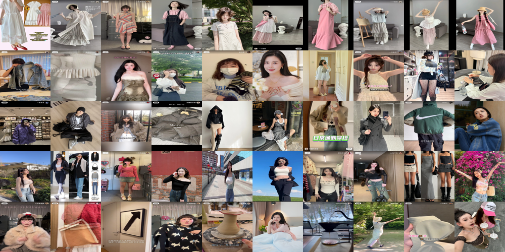
     
    <strong>Fig.10, month_4_top5</strong>

    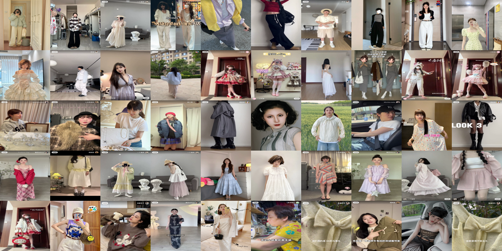
     
    <strong>Fig.11, month_5_top5</strong>

    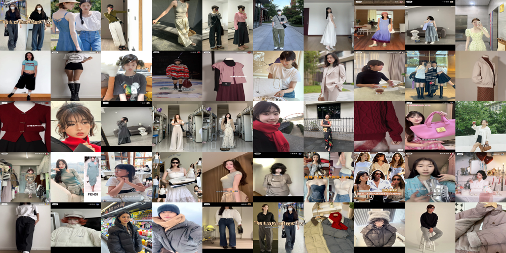
     
    <strong>Fig.12, month_6_top5</strong>

    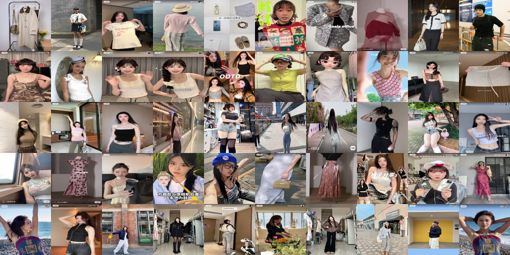
     
    <strong>Fig.13, month_7_top5</strong>

    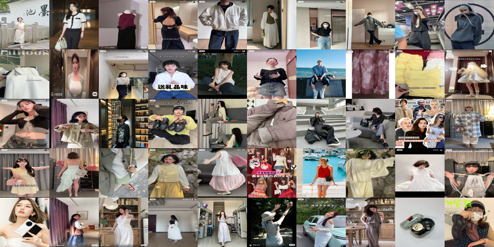
     
    <strong>Fig.14, month_8_top5</strong>

    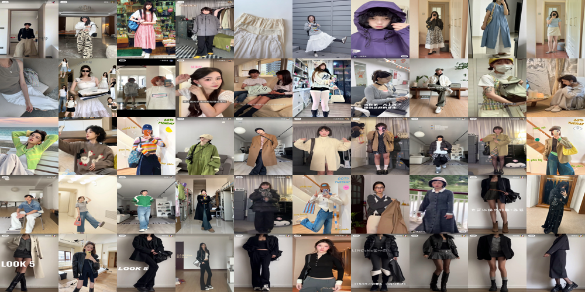
     
    <strong>Fig.15, month_9_top5</strong>

    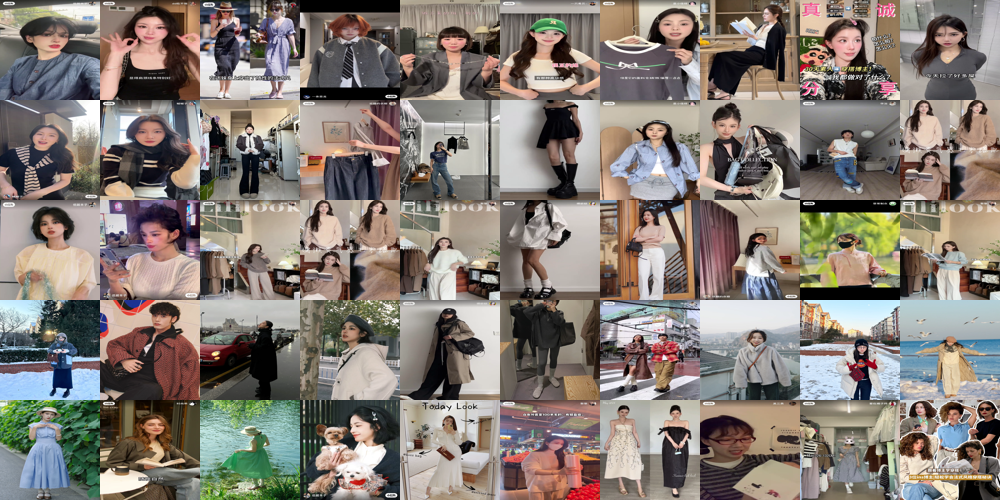
     
    <strong>Fig.16, month_10_top5</strong>

    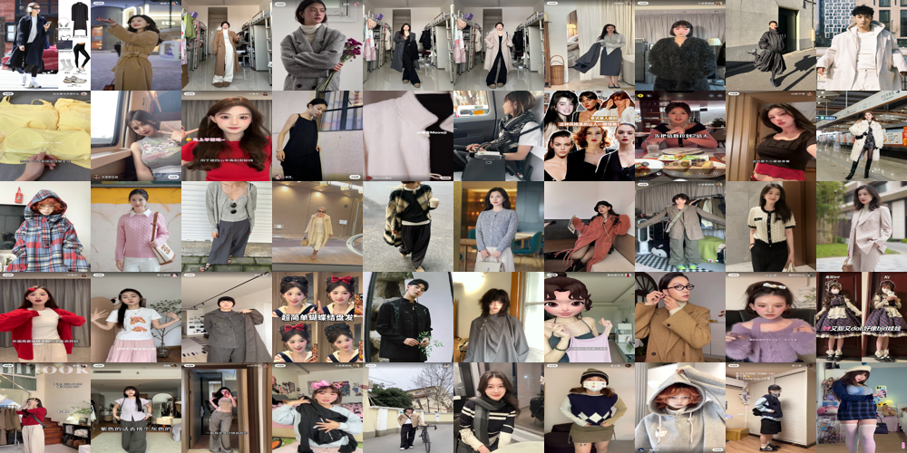
     
    <strong>Fig.17, month_11_top5</strong>

    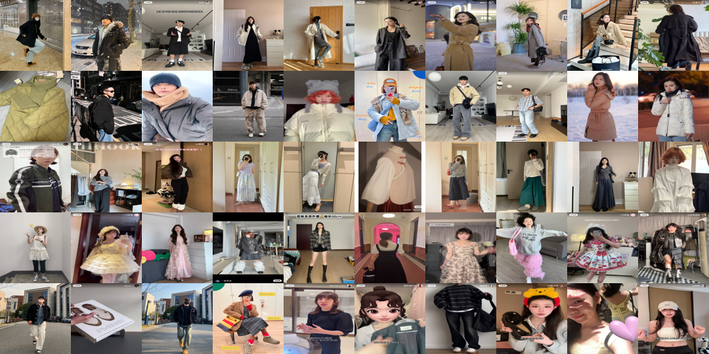
     
    <strong>Fig.18, month_12_top5</strong>

- 结论：
    - 相比于之前的segment衣服结果，这次没有出现头和饰品占比过高的bad case情况(因为这次提前去掉了衣服小于6%的图)。
    - 每个类别可以看出明显规律，基本make sense。如果还需要进一步提高效果，可以考虑使用88等其他更大数目的silhouette极值点聚类。

