# 可视化展示

## 1. input可视化
展示数据处理部分可视化：目的是排除舍去异常数据

### 1.1 cluster和segment

#### 1.1.1 两种典型bad case：
    - all black：
        - 描述：有效面积太少(可能存在遮挡)，导致all black。
        - 解决方法：由于无法识别风格，建议直接舍弃，去掉这些bad case后再做cluster得到风格。
    - 混杂分类：
        - 描述：确实难以分类的情况。各种风格混在一起，难以识别。
        - 解决方法：人工check？去掉这些聚类不明显的数据/或重新分配类别（找到其他优质类别的聚类中心代表性图片，然后再次相似度聚类，重新分配类别）

    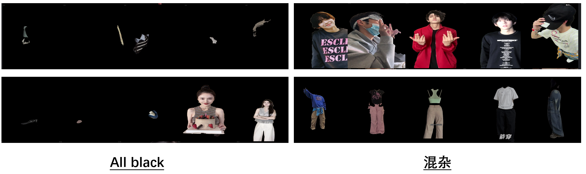
     
    <strong>两种典型bad case</strong>

#### 1.1.2 人体分割
人体segment：
- 优点是：all black概率更小。另外可以识别鞋子，首饰，发型等风格
- 缺点是：有身体姿态/布局的干扰。换句话说，来自同一个的post的几个不同的image，因为身体姿态类似，即使衣服不同，也会更加容易错误的聚合在一起。

    
     
    <strong>人体分割 可视化 good case</strong>

    
     
    <strong>人体分割 可视化 bad case</strong>

#### 1.1.3 衣服分割
衣服segment
- 优点是：纯衣服分类明显更准。可以识别颜色不同，但是“质感类型”一致的衣服。
- 缺点是：segment之后会有更大概率只剩下一小部分有效面积，出现all black的概率更大。

    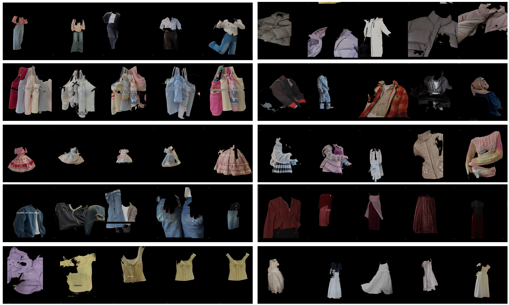
     
    <strong>衣服分割 可视化 good case</strong>

    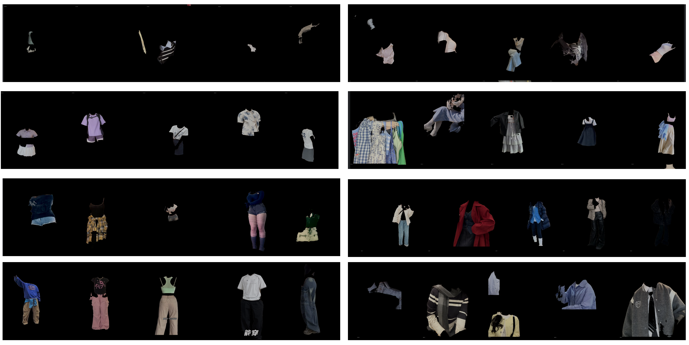
     
    <strong>衣服分割 可视化 bad case</strong>

#### 1.1.4 结论

    - 建议选择衣服segment，因为至少可以排除身体姿态/布局的干扰。主要缺点-all black出现的原因可能是原图人体本来就太小了，这种情况下，人体segment也未必准确。
    - 至于混杂分类的bad case，人体segment也同样无法很好的解决，是共同的问题。可能需要人工check，然后再次聚类，重新分配。

## 2 proportion

### 2.1 人体segment的proportion

- 2.1.1 可视化所有类别占比。基本均衡。在month=5的时候，有些占比特别小的

    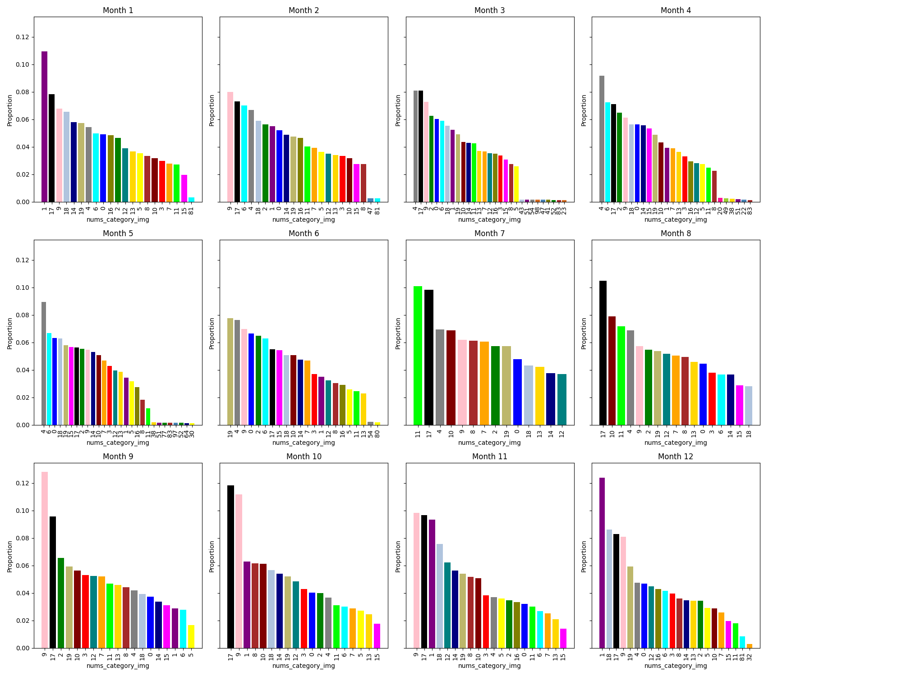
     
    <strong>proportion，每个月未来占比大于1%的类别 可视化</strong>

- 2.1.2 可视化全部12个月，每个月的所有类型（100类）占比proportion。可以看到绝大部分都小于0.01(1%)。可以认为占比大于1%的较为显著的类别

    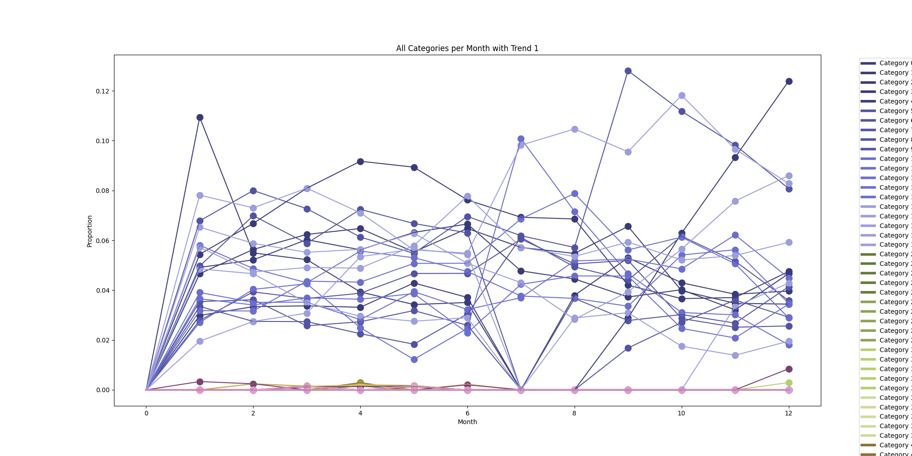
     
    <strong>proportion，每个月的所有类别 未来占比 可视化</strong>

- 2.1.3 可视化每个月大于1%的显著类别。并对于top3的类型标注序号。可以发现其中不少风格是长期持续存在的。

    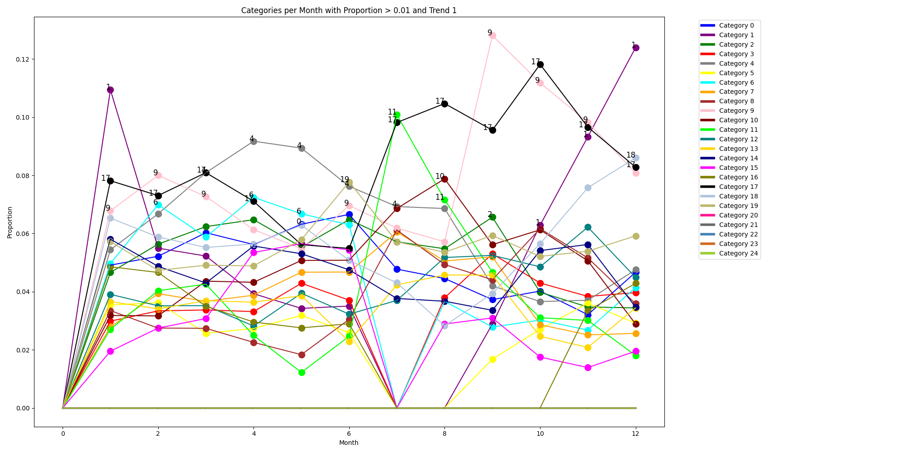
     
    <strong>proportion，每个月未来占比大于1%的类别 可视化</strong>

- 2.1.4 每个月具体会火的比例

| Month  |    1    |    2    |    3    |    4    |    5    |    6    |    7    |    8    |    9    |   10   |   11   |   12   |
|:-----:|:-------:|:-------:|:-------:|:-------:|:-------:|:-------:|:-------:|:-------:|:-------:|:------:|:------:|:------:|
| Top 3 | 1, 17, 9| 9, 17, 6| 4, 17, 9| 4, 6, 17| 4, 6, 0 |19, 4, 9|11, 17, 4|17, 10, 11| 9, 17, 2|17, 9, 1| 9, 17, 1| 1, 18, 17|

- 再次证明了，segment人体可能引入姿态布局干扰，下图中出现了很多后脑勺头发图。

    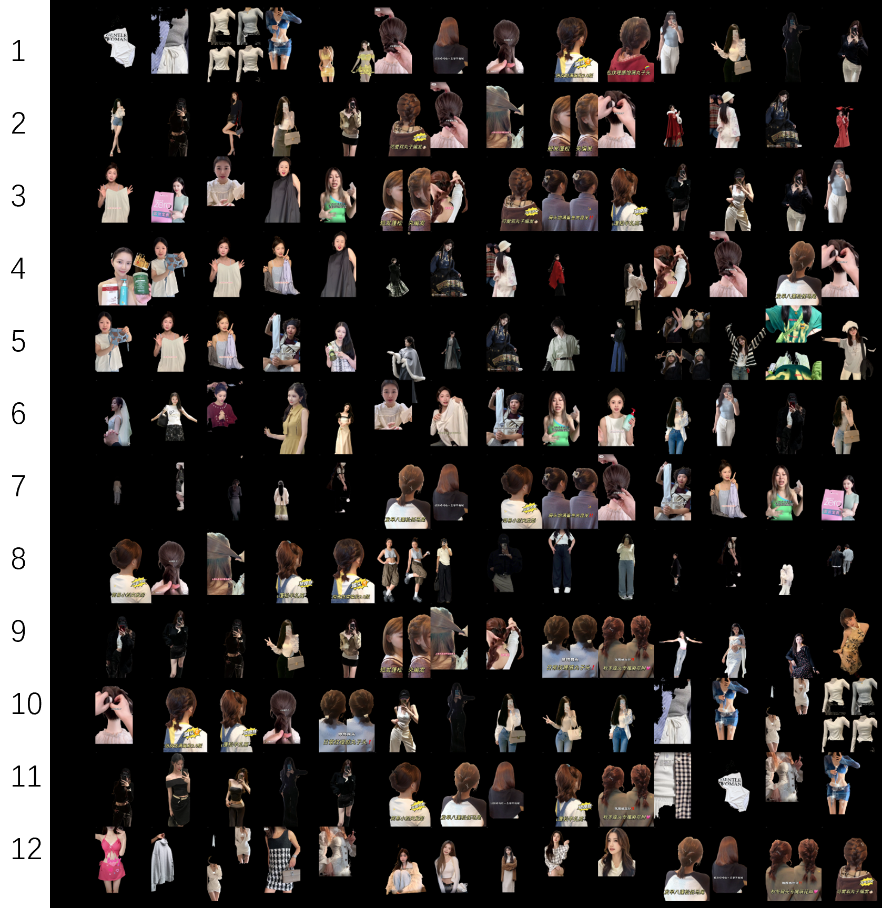
     
    <strong>每个月会火的比例 可视化，每行代表这个月会火的三个风格，并自随机采样5个。比如第一行代表第一个月的1, 17, 9类别各5张</strong>

### 2.2 衣服segment的proportion

- 2.2.1 可视化所有类别占比。突出的类别为第一类，类型就是all black。证明了segment衣服容易造成all black的情况。

    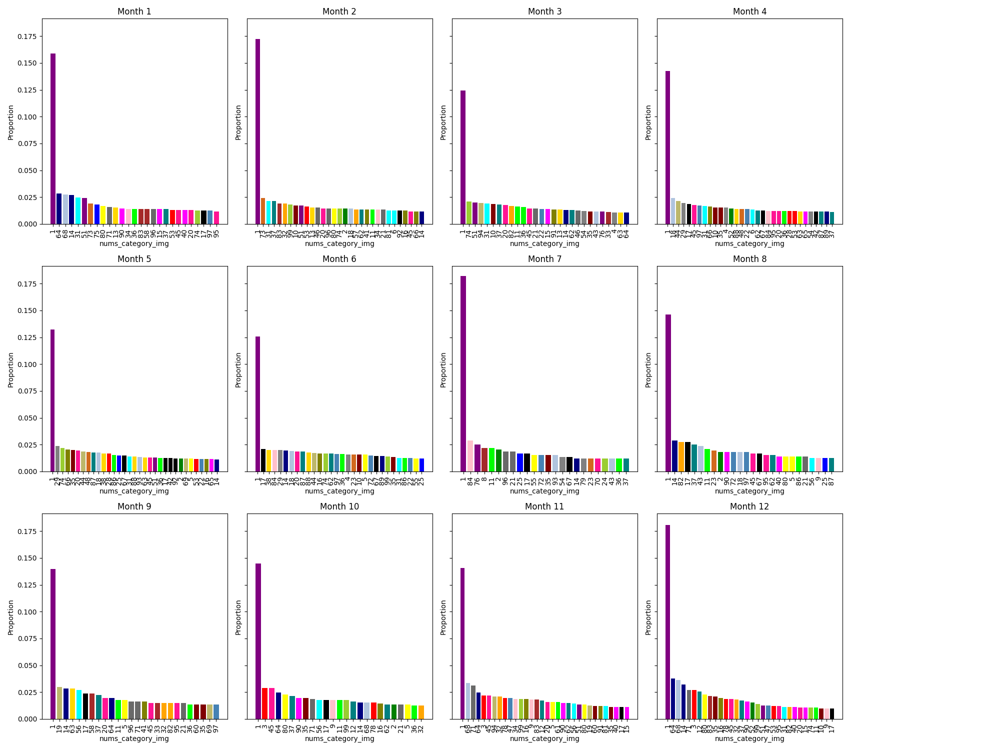
     
    <strong>proportion，每个月未来占比大于1%的类别 可视化</strong>

- 2.2.2 可视化全部12个月，每个月的所有类型（100类）占比proportion。

    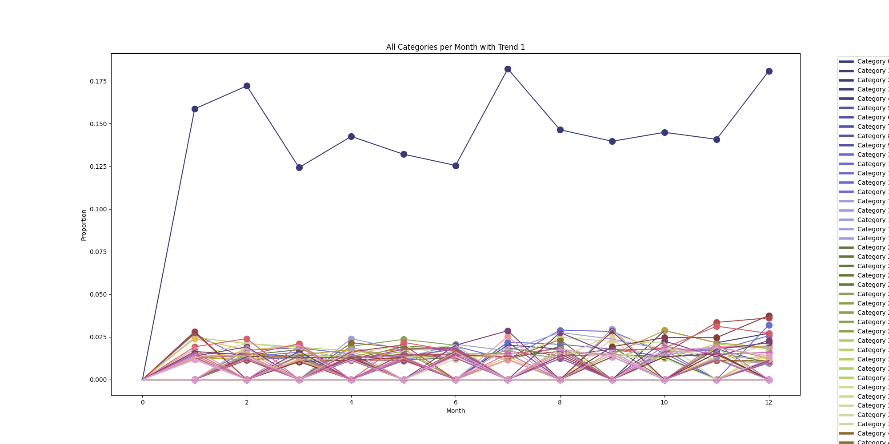
     
    <strong>proportion，每个月的所有类别 未来占比 可视化</strong>

- 2.2.3 去掉all balck的类型后。对于剩下的类型重新计算proportion占比，并对于top3的类型标注序号。注意到segment衣服难以出现长期具有统治力的风格，基本上每种风格火最多持续2个月就会消失。

    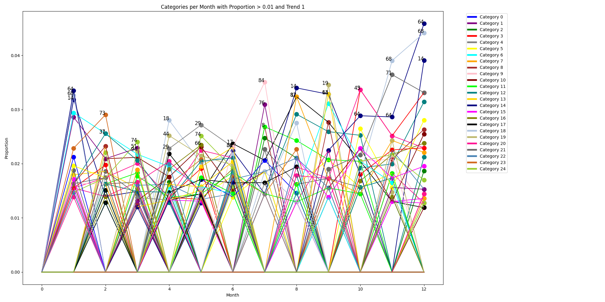
     
    <strong>proportion，每个月未来占比大于1%的类别 可视化</strong>

- 2.2.4 具体每个月会火的比例

| Month |    1    |    2    |    3    |    4    |    5    |    6    |    7    |    8    |    9    |   10   |   11   |   12   |
|:-----:|:-------:|:-------:|:-------:|:-------:|:-------:|:-------:|:-------:|:-------:|:-------:|:------:|:------:|:------:|
| Top 3 | 64, 68, 14 | 73, 31, 37 | 74, 51, 94 | 18, 44, 29 | 29, 74, 66 | 17, 38, 84 | 84, 76, 8 | 14, 17, 82 | 19, 14, 63 | 3, 45, 64 | 68, 71, 64 | 64, 68, 14 |

- 效果较好。可以看出明显的风格。

    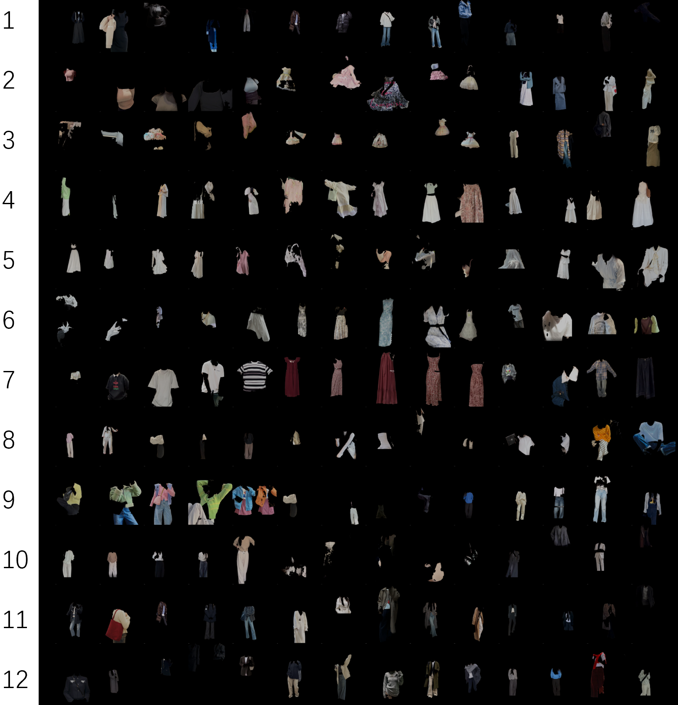
     
    <strong>每个月会火的比例 可视化，每行代表这个月会火的三个风格，并自随机采样5个。比如第一行代表第一个月的64, 68, 14类别各5张</strong>

## 3. output可视化
展示模型预测结果的可视化：目的是检验模型是否是按照预期要求正确训练，预测的结果是否可解释/满足要求。

### 3.1 segment body

- Regression:   Evaluation Loss: 0.0016040680557125597

| Post Date           | Post ID                      | Predicted Label    | Actual Label        |
|---------------------|------------------------------|--------------------|---------------------|
| 2024-11-19T00:00:00 | 6558110c000000003202ceb6     | 0.036438118666410446 | 0.06782026588916779 |
| 2024-11-07T00:00:00 | 654a1e97000000000f029d56     | 0.03643839806318283  | 0.06782026588916779 |
| 2024-10-18T00:00:00 | 652fb4a8000000001e02c024     | 0.036438118666410446 | 0.12394283711910248 |
| 2024-12-29T00:00:00 | 658ec3650000000012006fde     | 0.03643839806318283  | 0.04730434715747833 |
| 2024-10-30T00:00:00 | 653f9648000000001e033866     | 0.03643839806318283  | 0.08603091537952423 |
| 2024-11-24T00:00:00 | 656016af000000003203b36c     | 0.03643839806318283  | 0.04967904090881348 |
| 2024-11-17T00:00:00 | 655731f2000000001f02d788     | 0.03643839806318283  | 0.04967904090881348 |
| 2024-10-27T00:00:00 | 653b815100000000040396e4     | 0.036203332245349884 | 0.019539223983883858 |

    
     
    <strong>Segment body Regression output: 按照上述Post ID 输出图片</strong>

- Classification:   Test Accuracy: 95.45%

| Post Date           | Post ID                      | Predicted Label | Actual Label |
|---------------------|------------------------------|-----------------|--------------|
| 2024-11-21T00:00:00 | 655c80b000000000330093c0     | 2               | 2            |
| 2024-11-26T00:00:00 | 6562b917000000003300563e     | 2               | 2            |
| 2024-10-31T00:00:00 | 653fec5f000000001f034cce     | 2               | 2            |
| 2024-12-21T00:00:00 | 65840a5a000000000602b98c     | 2               | 2            |
| 2024-10-31T00:00:00 | 6540ff7c0000000025020b89     | 2               | 2            |
| 2024-10-16T00:00:00 | 652d2f0e000000001a01540a     | 2               | 2            |
| 2024-10-28T00:00:00 | 6531fda1000000001f03f950     | 2               | 2            |
| 2024-10-26T00:00:00 | 653a1632000000001f007a20     | 2               | 2            |
| 2024-11-07T00:00:00 | 6549b6690000000025008fb1     | 2               | 2            |
| 2024-10-28T00:00:00 | 653ce06c00000000250099fe     | 2               | 2            |
| 2024-11-14T00:00:00 | 6553966d000000000f02ba6c     | 2               | 1            |
| 2024-12-12T00:00:00 | 657844db000000000801fb87     | 2               | 2            |
| 2024-11-03T00:00:00 | 6544b4d6000000001f03fcb8     | 2               | 2            |
| 2024-11-08T00:00:00 | 654b85f7000000003103ed3f     | 2               | 2            |
| 2024-10-24T00:00:00 | 6537a2e8000000002202fe5f     | 2               | 2            |
| 2024-12-23T00:00:00 | 658648370000000009023b33     | 2               | 2            |
| 2024-11-06T00:00:00 | 6548b4e3000000001d015b26     | 2               | 2            |
| 2024-10-18T00:00:00 | 652f8c70000000001c016d99     | 2               | 2            |
| 2024-12-27T00:00:00 | 658c1ec2000000001000c781     | 2               | 2            |
| 2024-10-17T00:00:00 | 6512dbff000000001e02221e     | 2               | 2            |
| 2024-10-27T00:00:00 | 653bb723000000002201d7fa     | 2               | 2            |
| 2024-12-22T00:00:00 | 65857227000000000901cdb5     | 2               | 2            |

    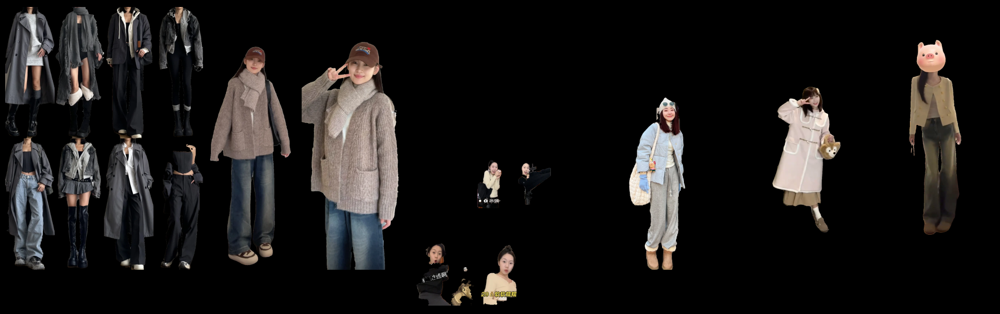
     
    <strong>Segment body classification output: 按照上述Post ID 输出图片</strong>

### 3.2 segment cloth

- Regression:   Evaluation Loss: 0.00024265328684123234

| Post Date           | Post ID                      | Predicted Label          | Actual Label            |
|---------------------|------------------------------|--------------------------|-------------------------|
| 2024-11-10T00:00:00 | 654e00fe000000003202ef87     | 0.027540611103177        | 0.032653059810400       |
| 2024-11-25T00:00:00 | 6561da6e0000000032004ea0     | 0.027540614828467        | 0.004081632476300       |
| 2024-11-08T00:00:00 | 65470313000000001e00d593     | 0.027540450915694        | 0.009795918129385       |
| 2024-10-20T00:00:00 | 6531f0130000000025015214     | 0.027540629729629        | 0.011884549632668       |
| 2024-11-14T00:00:00 | 6552f16e0000000032006b36     | 0.027540450915694        | 0.018775509670377       |

    
     
    <strong>Segment cloth Regression output: 按照上述Post ID 输出图片</strong>

- Classification:   Test Accuracy: 50.00%

| Post Date           | Post ID                      | Predicted Label | Actual Label |
|---------------------|------------------------------|-----------------|--------------|
| 2024-11-28T00:00:00 | 65652c6c000000003802b633     | 2               | 2            |
| 2024-12-07T00:00:00 | 657144eb00000000050390d6     | 2               | 1            |
| 2024-12-12T00:00:00 | 6578406c000000000901c16a     | 2               | 0            |
| 2024-11-02T00:00:00 | 654367580000000004038237     | 2               | 2            |
| 2024-12-08T00:00:00 | 6573131c000000000503a52d     | 2               | 1            |
| 2024-11-16T00:00:00 | 654d998e0000000032003ace     | 2               | 2            |

    
     
    <strong>Segment cloth classification output: 按照上述Post ID 输出图片</strong>

