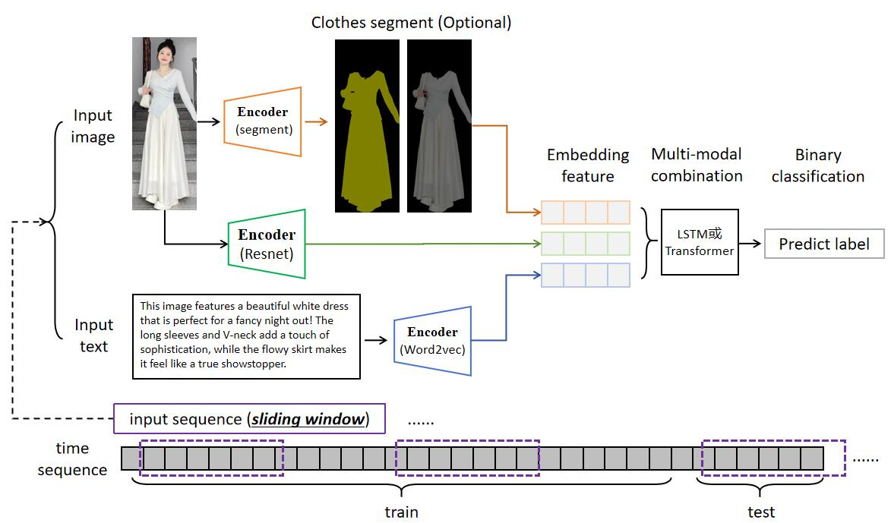

# 多模态时序识别

## 一、任务目标：

**需求：** 

对于一段时间内，社交媒体的人物衣服image和文本帖子text，同时嵌入同一个特征空间。然后训练学习，用于预测未来时间段的趋势（二分类，火或不火）。

**难点：** 
1. `多模态数据融合`：多模态的数据处理(嵌入embedding和融合?)。
2. `时序数据建模`：时间序列特征的处理。

## 二、解决方案：

### 整体方案:

    

 
核心思路为滑动窗口。
上图为方案1的思路。方案2仅替换了不同的Encoder，其余一致。

### 多模态数据融合

**1. 方案：**
- image数据使用[`resnet`](https://github.com/KaimingHe/deep-residual-networks)进行嵌入。并且考虑使用[`segment`](https://github.com/levindabhi/cloth-segmentation)，分割人物衣服去掉无关信息，得到mask。
- text数据使用[`word2vec`](https://code.google.com/archive/p/word2vec/)进行嵌入。

**2. 方案：**
- 对image和text，都使用大模型多模态对齐嵌入工具(如[`imagebind`](https://arxiv.org/abs/2305.05665)或[`imagebind-LLM`](https://arxiv.org/abs/2309.03905))进行嵌入。同样考虑使用[`segment`](https://github.com/levindabhi/cloth-segmentation)分割衣服。

### 时序数据建模：

**1. 方案：**

- [`LSTM`](https://www.sciencedirect.com/science/article/pii/S2212827121003796)是预测时间序列任务稳定可靠的方法，久经考验。

**2. 方案：**

- [`Transformer`](https://arxiv.org/abs/2306.07303)，是最近大模型等基座模型，在一些长时序预测任务上也展示出来不错的效果。

## 三、实验效果：

### 数据准备：

去小红书爬取1000个数据。数据格式如[`data`](https://github.com/dengxw66/Multimodal_MKT/data).

- 图片image例子：原始图片样例[`image_sample`](https://github.com/dengxw66/MKT_data_mining/blob/master/Multimodal/data/image_sample.jpg)
- 评论text例子：使用大模型[`ChatGLM`](https://github.com/THUDM/ChatGLM3)生成对应的各种风格语气的对应评论，模拟小红书评论。见[`captions_with_hotness_and_time.json`](https://github.com/dengxw66/MKT_data_mining/blob/master/Multimodal/data/captions_with_hotness_and_time.json)
- label标签：假定出现了“dress，sneakers或jeans”的风格会火起来，hotness的label为1。其余风格label为0。数据比例为：41.10%/59.90%
- time序列：假定1000条数据为1000天。取前800天训练，后200天测试。滑动窗口为10，所以每次送入模型一次输入1-9天内所有数据的image和text特征，并以第十天的label为标签。具体送入的批次如: 1-10,2-11,3-12,4-13...991-1000

### 多模态数据融合-实验

- 根据方案1,用resnet嵌入图片，用word2vec嵌入文本。
- 结果见[`train_separate.ipynb`](https://github.com/dengxw66/MKT_data_mining/blob/master/Multimodal/fusion/train_separate.ipynb)：

| Combination        | Train Accuracy | Test Accuracy |
| :---        |    :----:   |          ---: |
| text + mask + image | 1.0000         | 0.5957        |
| mask + image       | 1.0000         | 0.5532        |
| mask + text        | 1.0000         | 0.5957        |
| image + text       | 1.0000         | _**0.6809**_        |
| only mask          | 0.9784         | 0.5106        |
| only image         | 1.0000         | 0.5957        |
| only text          | 1.0000         | 0.5957        |

- 根据方案2,用imagebind-llm同时嵌入图片和文本。
- 结果见[`train_align.ipynb`](https://github.com/dengxw66/MKT_data_mining/blob/master/Multimodal/fusion/train_align.ipynb):

| Combination         | Train Accuracy | Test Accuracy |
| :---        |    :----:   |          ---: |
| text + mask + image | 1.0000         | 0.6383        |
| mask + image        | 1.0000         | 0.5957        |
| mask + text         | 0.9946         | 0.6170        |
| image + text        | 1.0000         | 0.5745        |
| only mask           | 0.9784         | 0.5745        |
| only image          | 1.0000         | 0.6170        |
| only text           | 0.7135         | 0.6809        |

### 时序数据建模-实验

- 根据方案1,用LSTM。结果见[`train_lstm.ipynb`](https://github.com/dengxw66/MKT_data_mining/blob/master/Multimodal/time_sequence/train_lstm.ipynb)：

- 根据方案2,用Transformer。结果见[`train_transformer.ipynb`](https://github.com/dengxw66/MKT_data_mining/blob/master/Multimodal/time_sequence/train_transformer.ipynb):

| Feature Combination  | LSTM Test Accuracy | Transformer Test Accuracy |
| :---:                 |      :----:         |          :---:             |
| mask + image + text | 62.11%              | 57.37%                    |
| image + text        | 62.11%              | 57.37%                    |
| mask + text         | 60.00%              | 57.37%                    |
| mask + image        | 61.58%              | 59.47%                    |
| only mask             | 60.00%              | 57.37%                    |
| only image            | 63.16%              | 57.37%                    |
| only text             | 66.84%              | 72.63%                    |

### 结论：

1. 多模态数据融合-结论
- 效果最好的是方案1，即[`resnet`](https://github.com/KaimingHe/deep-residual-networks)提取文本特征，然后使用[`word2vec`](https://code.google.com/archive/p/word2vec/)提取图片特征。准确率达到了68%

- 这是因为这两个特征提取模型都是各自领域的State-of-the-Art模型，效果稳定，久经考验。

2. 时序数据建模-结论
- 平均效果最好的是[`LSTM`](https://www.sciencedirect.com/science/article/pii/S2212827121003796)。但是[`Transformer`](https://arxiv.org/abs/2306.07303)在text维度的精度达到了最高的精度72.6%

- 可能是由于Transformer特别适合text数据，正如大模型的基座是transformer一样。

## 四、讨论：

### 为什么多模态大模型效果不好/不适合这个任务？
1. 多模态大模型(如[`imagebind`](https://arxiv.org/abs/2305.05665)或[`imagebind-LLM`](https://arxiv.org/abs/2309.03905))的数据集和训练过程强调的是图片文本的对齐，即图片翻译理解。并不是特征提取和识别风格。
2. 如果将图片翻译成文本再融合。相比于embedding嵌入为向量，信息损失太多。见表格的`only text`一栏。
3. 大语言模型是基于transformer输出上下文预测，核心能力是上下文补全。不适合这种二分类任务。经典泛用性深度学习网络MLP更加常见和适用于这个任务。

### 后续提高：
1. 更大规模的数据。现在的数据太少，因此训练集的泛化性不够，过于随机(可能根本不存在趋势)，准确率较低。
2. 超参数的微调，不同的时间窗口长度，不同的训练次数都可能影响模型精度。
3. text特征的预处理/数据清洗技术。这部分可以考虑使用大模型提取特征或者summary关键词。
4. 更多的模型架构和微调训练技术。
