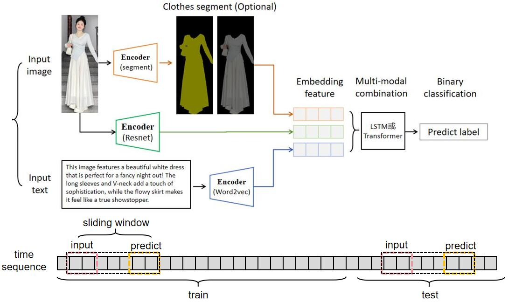

# 多模态时序识别

## 一、任务目标：

**需求：** 

对于一段时间内，社交媒体的人物衣服image和文本帖子text，同时嵌入同一个特征空间。然后训练学习，用于预测未来时间段的趋势（二分类，火或不火）。

**难点：** 
1. `多模态数据融合`：多模态的数据处理(嵌入embedding和融合?)。
2. `时序数据建模`：时间序列特征的处理。

## 二、解决方案：

### 整体方案:

    
         
    <strong>核心思路为滑动窗口：第n到n+5天的数据作为input，预测这个批次的style在第n+10到n+15天内的popular</strong>

### 多模态数据融合

- image数据使用[`resnet`](https://github.com/KaimingHe/deep-residual-networks)进行嵌入。并且考虑使用更强的[`segment`](https://github.com/dengxw66/Multimodal_MKT/segment/SemanticGuidedHumanMatting)，分割人物衣服去掉无关信息，得到mask。
- text数据使用[`word2vec`](https://code.google.com/archive/p/word2vec/)进行嵌入。

### 时序数据建模：

- [`LSTM`](https://www.sciencedirect.com/science/article/pii/S2212827121003796)是预测时间序列任务稳定可靠的方法，久经考验。

## 三、实验效果：

### 数据准备：

获取真实数据。数据格式如[`data`](https://github.com/dengxw66/Multimodal_MKT/data). 对于视频图片，在第15s截图处理。最后一共得到1703张图片。

- 图片image例子：原始图片样例[`image_sample`](https://github.com/dengxw66/MKT_data_mining/blob/master/Multimodal/data_redbook/image)，我们使用更好的更强的[`segment`](https://github.com/dengxw66/Multimodal_MKT/segment/SemanticGuidedHumanMatting)算法，得到的分割结果在[`seg_image`](https://github.com/dengxw66/MKT_data_mining/blob/master/Multimodal/data_redbook/segimage)
- 评论text例子：由于数据的文本和图片有很大部分缺失/无法对应，所以统一使用LLM做图片caption得到描述，来替代原本的文本。使用大模型[`ChatGLM`](https://github.com/THUDM/ChatGLM3)生成对应的各种风格语气的对应评论，模拟小红书评论。见[`captions.json`](https://github.com/dengxw66/MKT_data_mining/blob/master/Multimodal/data_redbook/captions.json)
- label标签：假设有100个类别。我们使用Kmeans聚类算法，得到每个图片的类别（见[`image_clusters.json`](https://github.com/dengxw66/MKT_data_mining/blob/master/Multimodal/data_redbook/image_clusters.json)），并统计每天（17条数据为一天）的风格，在n+10天后占比数量，该类别如果是主流风格则label为1，否则为0.（见[`train_data.json`](https://github.com/dengxw66/MKT_data_mining/blob/master/Multimodal/data_redbook/train_data.json)）
- time序列：假定1703条数据为100天（17条数据为一天）。取前80天训练，后20天测试。滑动窗口为5天，所以每次送入模型一次输入n到n+5天内所有数据的image和text特征，滑动窗口批量送入模型。

### 多模态数据融合-实验

- 根据方案1,用resnet嵌入图片，用word2vec嵌入文本,使用LSTM模型结构做训练。
- 结果见[`train-image-text-seg.ipynb`](https://github.com/dengxw66/MKT_data_mining/blob/master/Multimodal/time_sequence/train-image-text-seg.ipynb)：

| Combination        | Test Accuracy |
| :---        |      ---: |
| text + mask + image         | 61.50%        |
| mask + image             | 61.58%        |
| mask + text             | 59.91%        |
| image + text               | 57.13%        |
| only mask                   | 61.47%        |
| only image                 | 59.80%        |
| only text                   | 58.02%        |

## 四、讨论与提高。

1. 目前数据时间序列不够长。真实数据仅有约1703张图片做训练。训练集的泛化性不够，过于随机(可能根本不存在趋势)，准确率较低。
2. 图片质量不够高。在对比实验，使用更高高质量衣服数据训练，在[`train3-simulation.ipynb`](https://github.com/dengxw66/MKT_data_mining/blob/master/Multimodal/time_sequence/train3-simulation.ipynb)中，使用更高质量的图片，仅仅改变数据质量，就可以达到75%的准确率。
3. text的评论数据暂时还缺乏，无法对应。目前用LLM生成text模态，仅从实验中，无法看到明显增强效果。

